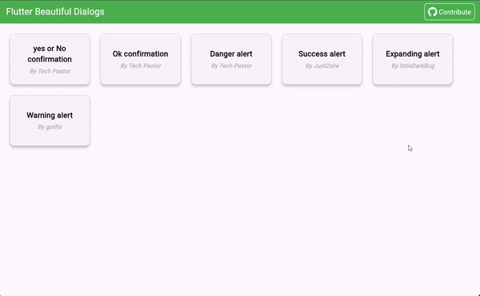

# Beautiful Dialogs - Flutter



Welcome to **Beautiful Dialogs**, a Flutter open-source project where developers can contribute by adding beautiful dialog widgets! 🌟

Explore a live demo of the dialogs [here](https://beautiful-dialogs.netlify.app/) to see the magic in action! ✨

## Getting Started

To contribute to this project, follow these simple steps:

### 1. Fork the repository and don't forget to add a star ⭐

Head over to the [repository](https://github.com/Docteur-Parfait/beautiful_dialog.git) and click the **Fork** button. Don’t forget to star the project as a token of appreciation!

### 2. Clone the repository

Clone your forked repository locally:

```bash
git clone https://github.com/YOUR_USERNAME/beautiful_dialog.git
cd beautiful_dialog
```

### 3. Create a new branch

Create a new branch for your custom dialog:

```bash
git checkout -b your-branch-name
```

### 4. Add your custom dialog

In the code, navigate to `lib/dialogs/dialog_class.dart`. This is where you can add your custom dialog function. For example:


```dart
static void showDangerAlertDialog(BuildContext context,
    {required String warningMessage}) async {
  return showDialog<void>(
    context: context,
    builder: (BuildContext context) {
      return AlertDialog(
        backgroundColor: Colors.red[50],
        title: const Text(
          'Danger',
          style: TextStyle(color: Colors.red),
        ),
        content: Text(
          warningMessage,
          style: const TextStyle(fontWeight: FontWeight.bold),
        ),
        actions: <Widget>[
          ElevatedButton(
            style: ElevatedButton.styleFrom(
              backgroundColor: Colors.red,
            ),
            child: const Text('Close'),
            onPressed: () {
              Navigator.of(context).pop();
            },
          ),
        ],
      );
    },
  );
}
```

### 5. Call your dialog

In `lib/views/dialog_view.dart`, use the `CustomButton` widget to call your dialog like this:

```dart
CustomButton(
  text: "Danger alert",
  author: "Tech Pastor",
  onTap: () => DialogClass.showDangerAlertDialog(context,
      warningMessage: "Do you want to logout?"),
)
```

### 6. Commit, push, and submit a pull request

Once you've added your dialog, commit your changes:

```bash
git add .
git commit -m "Added new custom dialog"
git push origin your-branch-name
```

Now, open a pull request from your forked repository.

## Contribution Guidelines

- Contributions must only involve adding new dialogs.
- Ensure the code structure and format is respected.
- Test your dialog before submitting the PR.

## License

This project is licensed under the MIT License - see the [LICENSE](LICENSE) file for details.

---

Happy coding and thank you for contributing to **Beautiful Dialogs**! 😄
